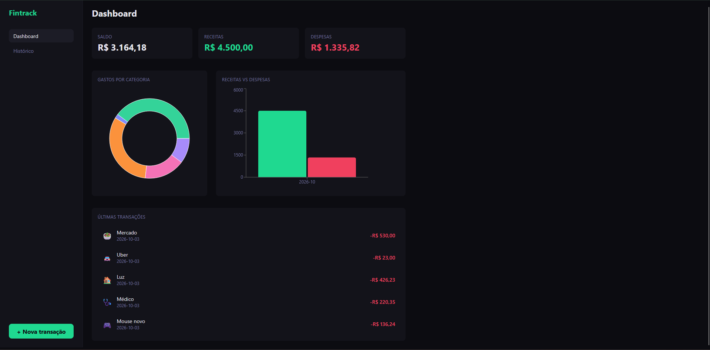

# Fintrack v2

App de finanças pessoais para controle de receitas e despesas, com gráficos e histórico filtrado.

## Preview



🔗 [Ver app ao vivo](https://fintrack-v2-neon.vercel.app)

## Stack

- React + Vite
- Tailwind CSS v4
- React Router v6
- Recharts
- Context API + useReducer
- localStorage

## Funcionalidades

- Adicionar receitas e despesas por categoria
- Dashboard com saldo, gráfico donut por categoria e gráfico de barras mensal
- Histórico com filtros por mês, categoria e tipo
- Persistência de dados no localStorage

## Como rodar

```bash
npm install
npm run dev
```

## Autor

João Gabriel Fazio — [github.com/JoaoFazio](https://github.com/JoaoFazio)
